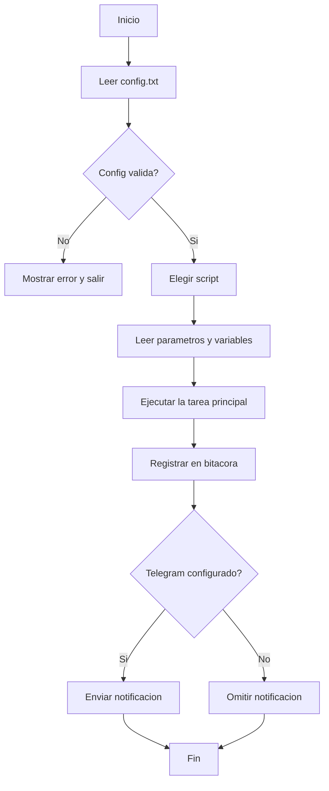
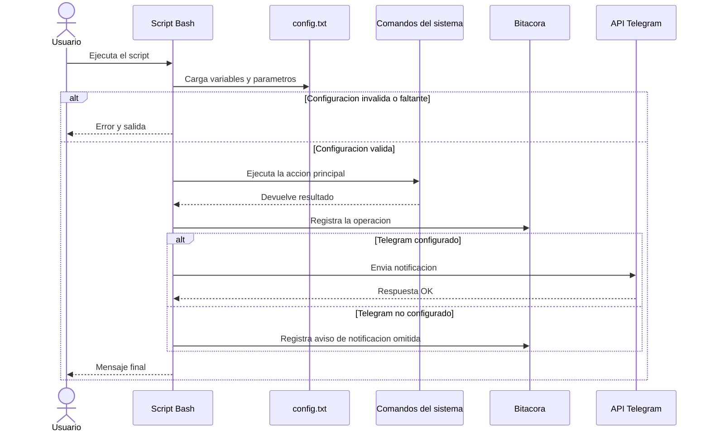

# Diagramas del proyecto

Este archivo resume el orden general de ejecucion del proyecto y de un script Bash tipico del laboratorio.

## Diagrama de flujo

### Orden del diagrama de flujo

1. El proceso inicia cuando el usuario ejecuta uno de los scripts del proyecto.
2. El script busca y carga `config.txt` para obtener credenciales, rutas y umbrales.
3. Si la configuracion no existe o es invalida, el flujo termina con un error.
4. Si la configuracion es valida, el script toma sus parametros propios y ejecuta la tarea principal.
5. Al terminar la tarea, registra el resultado en la bitacora central.
6. Si Telegram esta configurado, envia la notificacion; si no, solo deja evidencia en el log.
7. El flujo finaliza.

## Diagrama de secuencia

### Orden del diagrama de secuencia

1. El usuario lanza el script desde la terminal o desde otro flujo automatizado.
2. El script consulta `config.txt` antes de ejecutar cualquier accion importante.
3. Si falta configuracion, responde con error y termina sin continuar.
4. Si la configuracion existe, el script llama a las utilidades del sistema que correspondan a su funcion.
5. Cuando obtiene el resultado, lo guarda en la bitacora central.
6. Si hay datos de Telegram disponibles, envia la notificacion al bot.
7. Finalmente devuelve el estado al usuario y concluye la ejecucion.

## Alcance del flujo

Este esquema aplica al comportamiento comun de los scripts del proyecto: `usuarios.sh`, `respaldo.sh`, `monitoreo.sh`, `servicios.sh`, `remoto.sh`, `red.sh` e `inventario.sh`.